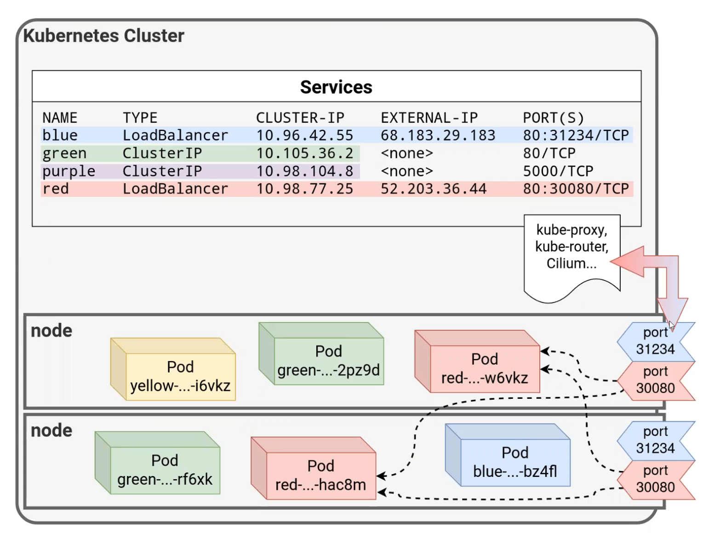
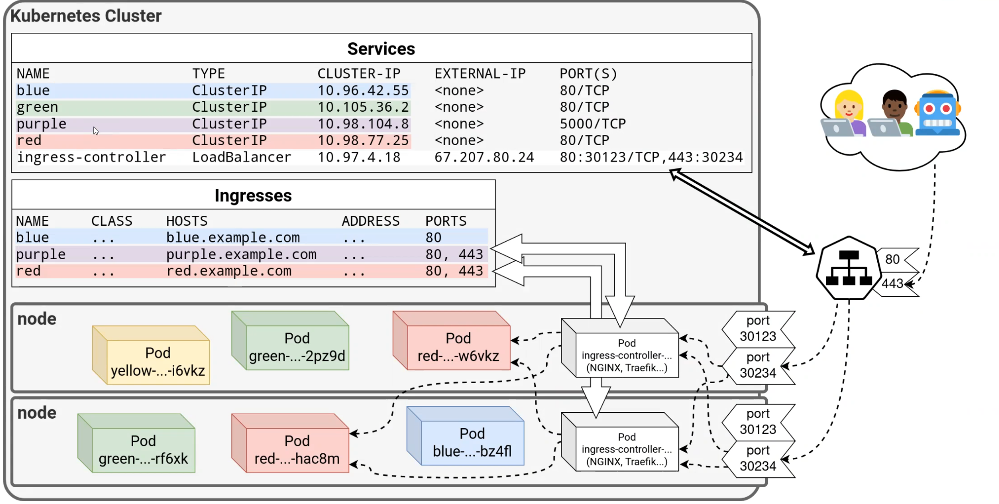

Секреты:
Секреты  - base64 encoded. Секреты вывели в отдельный ресурс, чтобы раздать разные права
kubectl get secrets -A

kubectl create secret generic k8s-example-simple --from-literal=app.custom.secret=secretValue -n demo
kubectl describe secret k8s-example-simple -n demo
kubectl get secret/k8s-example-simple -o json -n demo

kubectl port-forward deploy/k8s-example-simple -n demo 8080:8081

NodePort

Ingress

helm install nginx ingress-nginx/ingress-nginx -f nginx/values-local.yaml